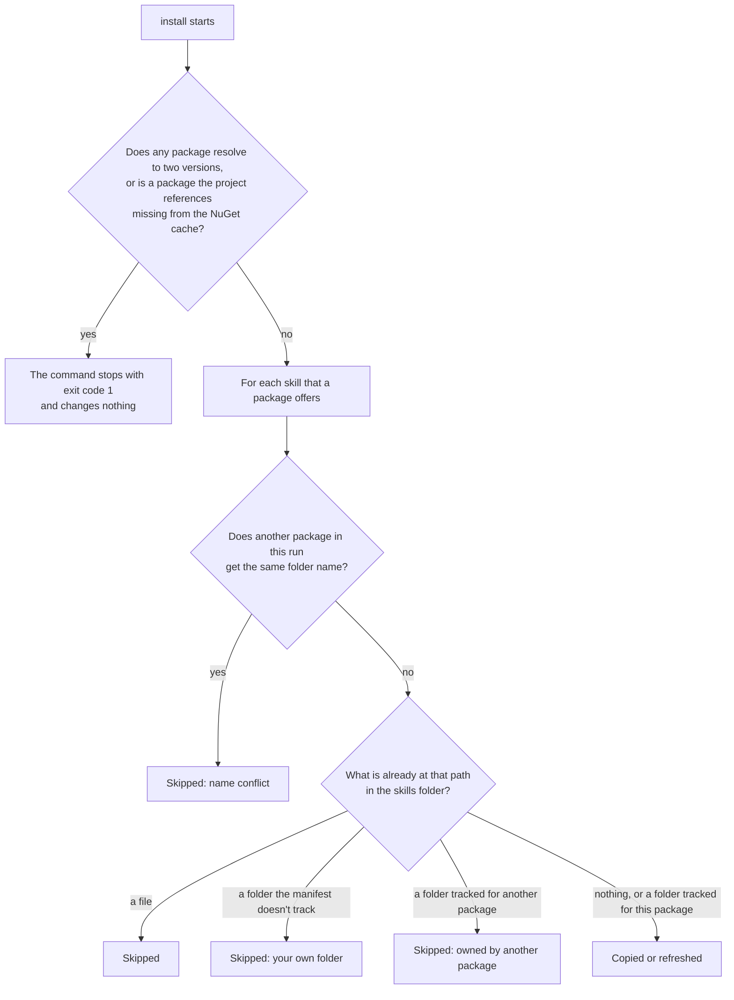
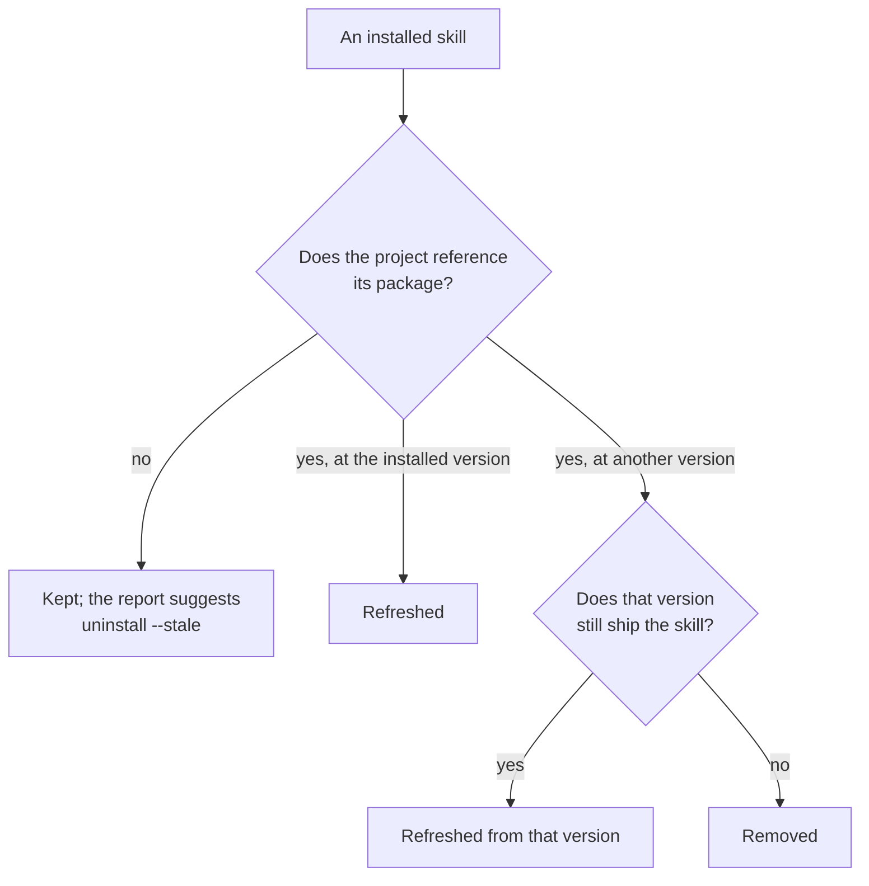

# dotnet-package-skills v1: scenarios and expected behavior

This document describes how v1 behaves, scenario by scenario. Rows marked **Changed in v1** or **New in v1** differ from the preview build (commit `7effb41`); everything else describes behavior that the preview build already had.

## 1. The idea

NuGet packages can ship agent skills: folders that contain a `SKILL.md` file, under the package's `skills/` folder. `dotnet package-skills` copies those folders into your repository, where coding agents can read them. A manifest in the skills folder records which folders the tool copied, so it can refresh or remove them later without touching anything you wrote yourself.

| Term | Meaning |
| --- | --- |
| Skill | A folder containing `SKILL.md`, shipped in a package's `skills/` folder. |
| Skills folder | Where skills are copied. The default is `.agents/skills` under the current folder; change it with `--destination`. |
| Manifest | `.dotnet-package-skills.json` in the skills folder. It lists the folders the tool manages, by package and version. |
| Tracked skill | A folder listed in the manifest. The tool may refresh or remove it. |
| Stale skill | A tracked skill that doesn't match the project: the project no longer references its package, or it uses a different version of that package. |
| Your own skill | Any other folder in the skills folder. The tool never changes or deletes it. |

The examples use these packages:

| Package | Ships |
| --- | --- |
| Mockly 1.10.0 | `mockly-usage`, `mockly-migration` |
| Mockly 1.11.0 | `mockly-usage` only; it dropped `mockly-migration` |
| Contoso.Widgets 2.3.0 | `contoso.widgets-usage` |
| Newtonsoft.Json 13.0.3 | No skills |

## 2. Commands and options

| Command | Use it to | Changes files |
| --- | --- | --- |
| `list` | See which skills your packages ship. | Never. |
| `install` | Copy new skills and bring installed ones up to date. | The skills folder and manifest, unless `--dry-run` is used. |
| `uninstall` | Remove skills that the tool installed. | The skills folder and manifest, unless `--dry-run` is used. |

| Option | `list` | `install` | `uninstall` | Meaning |
| --- | --- | --- | --- | --- |
| `-t, --target <PATH>` | Yes | Yes | With `--stale` | Solution or project to read. Without it, the tool finds one in the current folder and prefers a solution. Can't be combined with `--package`. |
| `-p, --package <ID@VERSION>` | Yes | Yes | | Name packages directly instead of reading a project. Repeatable, with one version per package. |
| `-p, --package <ID[@VERSION]>` | | | Yes | Remove only this package's skills, or only if that version is installed. |
| `--stale` | | | Yes | Remove only stale skills. Requires a project or solution: the one passed with `--target`, or the one found in the current folder. Can't be combined with `--package`. **New in v1.** |
| `-d, --destination <PATH>` | Yes | Yes | Yes | The skills folder. |
| `-i, --interactive` | | Yes | Yes | Choose skills from a paged checklist. |
| `--dry-run` | | Yes | Yes | Show what would happen; change nothing. |
| `--no-restore` | Yes | Yes | With `--stale` | Don't run `dotnet restore` when the project isn't restored. |
| `--global-packages <PATH>` | Yes | Yes | | Read a different NuGet cache. |

**Changed in v1:** the `--json` option is removed from every command. Each command reports its results as text only.

Only a project's direct package references are read. Repositories are expected to manage package versions with [Central Package Management](https://learn.microsoft.com/nuget/consume-packages/central-package-management), so that each package resolves to one version. `uninstall` needs neither a project nor the NuGet cache, except that `uninstall --stale` reads the project's package references. It never reads the packages themselves.

## 3. What each command can change

Read these tables first. *Refresh* means that the tracked folder is deleted and copied again from the package. Adding `--dry-run` to any row shows the same result without changing anything.

| Mode | Copies | Refreshes | Removes | Stops without changing anything when |
| --- | --- | --- | --- | --- |
| `install` for the project | Every new skill | Every installed skill whose package the project references, from the version the project uses | Skills that a package's new version no longer ships | Any package resolves to two versions, a package that the project references isn't in the NuGet cache, or a package's new version drops a skill whose name another package ships (E6) |
| `install --package X@V` | X's new skills | X's installed skills, from version V | X's skills that version V no longer ships | The same package is named with two versions, or version V drops a skill whose name another named package ships (E6) |
| `install -i` for the project | The new skills you check | Nothing | Nothing | Any package resolves to two versions, a package that the project references isn't in the NuGet cache, or any installed skill is stale (run `uninstall --stale` first) |
| `install -i --package X@V` | The new skills from X that you check | Nothing | Nothing | The same package is named with two versions, or X is installed at another version (run `uninstall --package X` first) |

No install mode removes skills whose package left the project. A plain `install` keeps them and suggests `uninstall --stale`.

**Changed in v1:** `install` no longer removes skills of packages that left the project. `install --package` now removes the skills that its version no longer ships. `install -i` only adds skills, and stops when installed skills are stale.

| Mode | Removes |
| --- | --- |
| `uninstall` | Every tracked skill. |
| `uninstall --package Mockly` | Mockly's tracked skills. |
| `uninstall --package Mockly@1.10.0` | Mockly's tracked skills, only if 1.10.0 is the installed version. |
| `uninstall --stale` | Stale skills, including skills added with `install --package` for packages that the project doesn't reference. **New in v1.** |
| `uninstall -i` | The tracked skills you check. Nothing starts checked. |
| `uninstall -i --stale` | The stale skills you check. Only stale skills are listed, and nothing starts checked. **New in v1.** |

To move a package's skills to the version that the project now uses, instead of removing them, run a plain `install`.

## 4. Scenarios

### A. Getting started

| # | Situation | You run | What happens |
| --- | --- | --- | --- |
| A1 | The project references Mockly 1.10.0 and Newtonsoft.Json. | `install` | Copies `mockly-usage` and `mockly-migration` into `.agents/skills` and creates the manifest. Newtonsoft.Json is scanned and has nothing to copy. |
| A2 | No referenced package ships skills. | `install` | Reports that no bundled skills were found. Creates no folder and no manifest. |
| A3 | You want to look before copying anything. | `list`, or `install --dry-run` | Shows what would be copied. Nothing changes. |
| A4 | You want only some of the skills. | `install -i` | Opens a paged checklist of the skills that aren't installed yet, with their descriptions. The line under the title says that installed skills aren't listed. Everything starts unchecked, and the skills you check are copied. **Changed in v1:** the preview build listed installed skills too, checked, and unchecking one removed it. |

### B. Keeping skills up to date

| # | Situation | You run | What happens |
| --- | --- | --- | --- |
| B1 | Nothing has changed since the last install. | `install` | Tracked skills are copied again. The files and manifest come out identical, so git shows no changes. |
| B2 | You edited `mockly-usage` by hand. | `install` | Your edits are replaced with the package's copy. Keep your own guidance in your own folders. |
| B3 | You deleted the `mockly-usage` folder by hand. | `install` | It's copied again. `install -i` doesn't list it, because the manifest still tracks it. |
| B4 | Nothing is stale, and you want to add a skill. | `install -i` | Installed skills are left exactly as they are, including any edits. Only the skills you check are copied. **Changed in v1.** |

### C. A package changes version

Mockly 1.10.0 is installed with `mockly-usage` and `mockly-migration`, and the project now uses Mockly 1.11.0.

| # | Situation | You run | What happens |
| --- | --- | --- | --- |
| C1 | 1.11.0 ships the same skills. | `install` | Both skills are refreshed from 1.11.0, and the manifest records 1.11.0. |
| C2 | 1.11.0 also adds `mockly-testing`. | `install` | `mockly-testing` is copied too. |
| C3 | 1.11.0 dropped `mockly-migration`. | `install` | `mockly-usage` is refreshed, and `mockly-migration` is removed. |
| C4 | Same as C3. | `install --package Mockly@1.11.0` | Same as C3. **Changed in v1:** the preview build kept `mockly-migration`, still recorded under 1.10.0. |
| C5 | Any version change. | `install -i` | Stops with exit code 1, because Mockly's installed skills are stale. After `uninstall --stale` removes them, `install -i` lists 1.11.0's skills as new. To move to 1.11.0 in one step instead, run a plain `install`; it also copies any new skills. **Changed in v1.** |
| C6 | Any version change. | `install -i --package Mockly@1.11.0` | Stops with exit code 1, because Mockly 1.10.0 is installed, and asks you to run `uninstall --package Mockly` first. A plain `install --package Mockly@1.11.0` moves the skills to 1.11.0 instead. **Changed in v1.** |
| C7 | Mockly moves to an older version. | Any command | The same rules as an upgrade apply. |

### D. A package is removed from the project

Contoso.Widgets was installed, and the project no longer references it.

| # | Situation | You run | What happens |
| --- | --- | --- | --- |
| D1 | As described. | `install` | `contoso.widgets-usage` is kept. The report says that its package is no longer referenced and suggests `uninstall --stale`. **Changed in v1:** the preview build removed it without asking. |
| D2 | As described. | `install -i` | Stops with exit code 1 and asks you to run `uninstall --stale` first. **Changed in v1:** the preview build listed it, and removed it if you unchecked it. |
| D3 | As described. | `install --package Mockly@1.11.0` | `contoso.widgets-usage` is left alone. |
| D4 | As described. | `uninstall --stale` | Removes `contoso.widgets-usage`. Add `--dry-run` to preview, or `-i` to choose. **New in v1.** |
| D5 | Alpha's skills were added with `install --package Alpha@1.0.0`, and the project doesn't reference Alpha. | `install`, `install -i`, or `uninstall --stale` | `install` keeps them and prints the hint. `install -i` stops until they're removed. `uninstall --stale` removes them. Use one source per skills folder: the project or `--package`. |

### E. Conflicts: the tool never overwrites

| # | Situation | You run | What happens |
| --- | --- | --- | --- |
| E1 | You already have your own `mockly-usage` folder. | `install` | Mockly's copy is skipped with the reason "the destination folder already exists and is not managed by this tool". Your folder is untouched. |
| E2 | Packages Alpha and Beta both ship a skill named `shared`. | `install` | The first package in a fixed order gets it: alphabetical by package ID for a project, or command-line order with `--package`. The other package's copy is skipped with a reason. |
| E3 | `shared` is installed from Alpha, and Beta also ships it. | `install` | Alpha keeps it, including when the project no longer references Alpha; Beta's copy is skipped. To switch owners, uninstall Alpha's skill first. |
| E4 | A file named `shared` is in the skills folder. | `install` | The skill is skipped. |
| E5 | Two projects reference different versions of the same package, for example through `VersionOverride`. This applies to every package, including ones that ship no skills, such as Newtonsoft.Json. | `install` in any mode, or `install --package` naming one package with two versions | Stops with exit code 1, changes nothing, and names the package and its versions. Align the versions with Central Package Management, and then try again. `list` still works. **Changed in v1:** the preview build installed from both versions. |
| E6 | `shared` is installed from Alpha 1.0.0. The project moves to Alpha 2.0.0, which doesn't ship `shared`, and Beta also ships it. | `install`, including `--dry-run` | Stops with exit code 1 and changes nothing. Removing Alpha's copy would hand the name to Beta, and keeping it would record Alpha 1.0.0's copy as 2.0.0's. The error suggests `uninstall --package Alpha`; after it, `install` copies Alpha 2.0.0's skills and Beta's `shared`. **New in v1.** |

Skipped skills don't fail the command; it still exits with code 0. With `install -i`, skills that can't be installed because of a conflict aren't listed, and the report shows them as skipped.

### F. The NuGet cache

| # | Situation | You run | What happens |
| --- | --- | --- | --- |
| F1 | A package that the project references isn't in the NuGet cache, for example after the cache was cleaned and `--no-restore` was used. | `install` or `install -i`, including with `--dry-run` | Stops with exit code 1, changes nothing, and asks you to run `dotnet restore`. |
| F2 | A package isn't in the NuGet cache. | `list`, `install --package`, or `install -i --package` | The package is treated like one without skills, with no warning. A version that isn't in the cache never causes a removal: with `install --package Mockly@1.11.0` and 1.11.0 missing, Mockly's installed skills stay as they are. **Changed in v1:** the preview build warned that the package was "resolved but not extracted" and listed it in the JSON `notOnDisk` field. |
| F3 | `dotnet restore` fails. | `install`, `list`, or `uninstall --stale` | Stops with restore's error. |
| F4 | Packages are missing from the NuGet cache. | `uninstall --stale` | Not affected, because it reads only the project's package references. |

### G. Removing skills

| # | Situation | You run | What happens |
| --- | --- | --- | --- |
| G1 | Mockly and Contoso.Widgets skills are installed, plus your own `team-notes` folder. | `uninstall` | Removes the tracked skills. `team-notes` stays. The manifest is deleted, and the skills folder too if it's empty. |
| G2 | Same as G1. | `uninstall --package Mockly` | Removes only Mockly's skills. |
| G3 | Same as G1. | `uninstall -i` | Lists only the tracked skills, none checked. The ones you check are removed. |
| G4 | Nothing is tracked. | `uninstall` | Reports that there's nothing to remove, and exits with code 0. |
| G5 | Same as G1. | `uninstall --dry-run` | Shows what would be removed. Nothing changes. |
| G6 | Mockly 1.10.0 is installed, and the project now uses 1.11.0. | `uninstall --stale` | Removes Mockly's skills, because they don't match the project. To move them to 1.11.0 instead, run a plain `install`. **New in v1.** |
| G7 | Nothing is stale. | `uninstall --stale` | Reports "Nothing to remove. No stale skills were found." and exits with code 0. **New in v1.** |
| G8 | There's no solution or project in the current folder, and `--target` isn't given. | `uninstall --stale` | Stops with exit code 1 and asks for a target. Nothing is removed. **New in v1.** |

### H. Teams and source control

| # | Situation | You run | What happens |
| --- | --- | --- | --- |
| H1 | The skills folder and manifest are committed, and a teammate runs `install` with the same packages. | `install` | The same files are produced, so there's no diff. The manifest is sorted and uses LF line endings on every operating system. **Changed in v1:** LF line endings. |
| H2 | A merge leaves conflict markers in the manifest. | `install` or `uninstall` | Stops with exit code 1 and changes nothing until you fix the file. `list` still works. |
| H3 | The manifest says `"version": 2`, written by a newer tool. | `install` or `uninstall` | Stops and asks you to update the tool. **New in v1.** |
| H4 | The manifest uses the pre-release format, with an `installed` list. | `install` or `uninstall` | Stops and asks you to move the skills folder aside and reinstall. **New in v1.** |
| H5 | Two runs use the same skills folder at the same time. | Any command that changes files | The second run waits up to 30 seconds, then stops with "Another operation is using the skills destination … Wait for it to finish and try again." |

### I. Scripts and CI

| # | Situation | What happens |
| --- | --- | --- |
| I1 | A script needs to know which skills are installed. | It reads the manifest, which is versioned JSON and the tool's only machine-readable output. |
| I2 | CI runs `install`. | The job checks the exit code. `install` exits with code 0 even when skills are skipped; skips appear as warnings in the text report. |
| I3 | CI should keep the skills folder exactly in sync with the project. | Run `install`, then `uninstall --stale`, and then `git status` to see what changed. **Changed in v1:** in the preview build, `install` alone did both. |
| I4 | A command fails. | Exit code 1 and an error on standard error. |
| I5 | A script passes `--json` to any command. | Rejected as an unrecognized argument, with exit code 1. **Changed in v1:** the preview build accepted it on every command. |

The text report is for people and isn't a stable format for scripts to parse.

### J. The interactive checklist

| # | Situation | What happens |
| --- | --- | --- |
| J1 | You open the checklist. | Skills are shown a page at a time, with descriptions. It uses a temporary screen, so it doesn't stay in your scrollback. |
| J2 | Every skill that the packages ship is already installed. | `install -i` reports "Nothing new to install." and exits with code 0, without opening the checklist. **New in v1.** |
| J3 | The terminal is too small. | The line under the title is dropped first. If the checklist still doesn't fit, the command exits with code 1 and asks you to enlarge the window. Nothing changes. **New in v1:** the line under the title. |
| J4 | You cancel. | "Cancelled. Nothing was copied or removed." |
| J5 | Another run changes the installed skills while the checklist is open. | Accepting fails, and nothing changes. |

## 5. How `install` decides

What `install` checks before it changes anything, and then what happens to each skill that a package offers. `install -i` also stops when installed skills are stale, and applies the per-skill checks only to the skills you check.



What a plain `install` for the project does with each installed skill:



- `install --package X@V` follows this chart for X's skills only, and keeps every other skill.
- `install -i` doesn't follow this chart. If any installed skill would take the "no" or "another version" branch, it stops and asks you to run `uninstall --stale`. Otherwise, it leaves installed skills as they are.
- An installed skill involved in a conflict is never removed by the same run. If its package moved to a version that no longer ships it, `install` stops instead (E6). A version that isn't in the NuGet cache never causes a removal.

## 6. What the tool writes

### Manifest

```json
{
  "version": 1,
  "packages": {
    "contoso.widgets": {
      "version": "2.3.0",
      "skills": [
        "contoso.widgets-usage"
      ]
    },
    "mockly": {
      "version": "1.10.0",
      "skills": [
        "mockly-migration",
        "mockly-usage"
      ]
    }
  }
}
```

- The top-level `version` is the file format version, as in `dotnet-tools.json`. The `version` inside each package is the package version.
- Package IDs are written in lowercase, as the .NET SDK does for tool manifests. Each package has one version.
- There's no `isRoot`, because the tool never searches parent folders, and no `note`.
- The file is UTF-8 without a byte order mark, with LF line endings and packages and skills in a stable order.

The manifest is the only file the tool writes besides the copied skills, and its only machine-readable output.

## 7. Decisions

| # | Decision |
| --- | --- |
| 1 | No command has a `--json` option. Passing it fails as an unrecognized argument. |
| 2 | Commands report their results as text only. The manifest, which records what's installed, is the tool's only machine-readable output. |
| 3 | `list` and `install --package` never report missing packages. A project `install`, including `-i`, still stops and asks you to run `dotnet restore`. |
| 4 | The manifest follows the `dotnet-tools.json` layout: a format `version` and a `packages` map keyed by lowercase package ID. |
| 5 | Each package has exactly one version in the manifest. |
| 6 | When a package changes version, `install` and `install --package` refresh its skills and remove the ones that the new version dropped. |
| 7 | `install` never removes skills of packages that left the project. It keeps them and prints a hint. |
| 8 | `uninstall --stale` removes stale skills: skills whose package the project no longer references, or uses at a different version. It requires a project or solution, from `--target` or found in the current folder. |
| 9 | `install -i` only adds skills. It lists only skills that aren't installed, all unchecked, and leaves installed skills as they are. |
| 10 | A project `install -i` stops with exit code 1 when any installed skill is stale, and asks you to run `uninstall --stale` first. |
| 11 | Repositories are expected to use Central Package Management. `install`, in every mode, never proceeds when it finds two versions of the same package, whether or not that package ships skills. It stops with exit code 1, changes nothing, and names the package and its versions. Only direct references count, because those are all the tool reads. `list` still works. |
| 12 | The manifest is always written with LF line endings, so it's byte-for-byte identical on every operating system, whatever the repository's git line-ending settings. |
| 13 | Manifests in the pre-release format aren't converted. `install` and `uninstall` stop and ask you to move the skills folder aside. |
| 14 | Package IDs keep NuGet's casing when they come from packages, and are lowercase when they come from the manifest, as in the `uninstall` report and the stale hint. |
| 15 | A version that isn't in the NuGet cache never causes a removal. |
| 16 | `install -i --package X@V` stops when X is installed at another version, and asks you to run `uninstall --package X` first. |
| 17 | `uninstall --stale` can't be combined with `--package`, and `uninstall` accepts `--target` and `--no-restore` only together with `--stale`. |
| 18 | `uninstall --stale` still runs when a package resolves to two versions. A skill counts as stale only if the project doesn't reference its installed version at all. |
| 19 | `uninstall --stale --dry-run` is the way to see stale skills; there's no machine-readable list of them. |
| 20 | When nothing new is available, `install -i` says so and exits with code 0. |
| 21 | The line under the checklist title gives way when the terminal is too small to fit it, rather than the checklist refusing to open. |
| 22 | When a package moves to a version that no longer ships an installed skill, and another package in the same run ships a skill with that name, `install` stops and suggests `uninstall --package`. It doesn't hand the name over, and it doesn't keep the old copy under the new version (E6). |
| 23 | The commands that reports and errors suggest repeat the `--target` and `--destination` of the command that was run, so they can be run as printed. |
| 24 | Package IDs follow NuGet's own rule, which allows letters outside ASCII, on the command line and in the manifest. The tool never writes a manifest that it would refuse to read. |

Known consequence: skills added with `install --package` for packages outside the project count as stale for project commands, so a project `install -i` stops until they're removed.

## 8. See also

- [README](../README.md)
- [Functional specification](functional-spec.md)
- [`dotnet package-skills` command reference](dotnet-package-skills.md)
